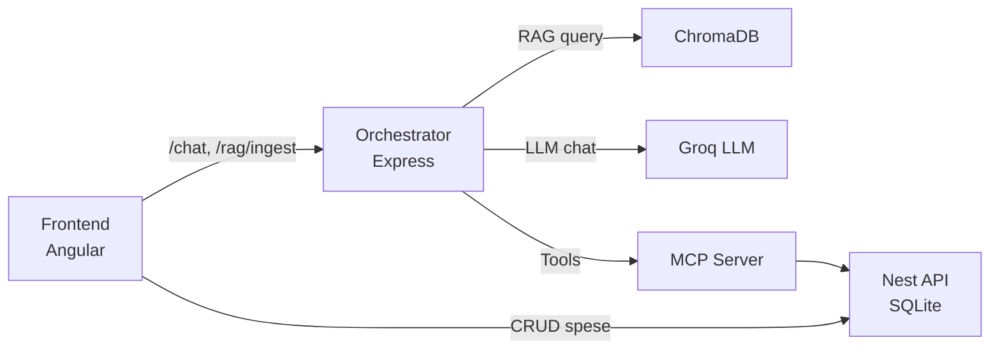

# Architettura del progetto (focus Chatbot RAG)

Questo documento descrive in modo semplice come sono fatte le 3 app e come collaborano tra loro, con focus sul chatbot.

## Diagramma architettura

## Componenti principali

1) **Frontend (Angular)**
   - UI per CRUD spese + chat.
   - Porta: `http://localhost:4200`.
   - Chiama l’orchestrator per la chat e la Nest API per il CRUD.

2) **API (NestJS + SQLite)**
   - Espone le API CRUD delle spese.
   - Persiste su `api/data/expenses.sqlite`.
   - Porta: `http://localhost:3000`.

3) **Orchestrator (Node.js + Express)**
   - Gestisce la logica RAG documentale + routing intent (spese vs documenti) + chiamate LLM.
   - I tool spese possono passare tramite MCP server (opzionale) o chiamare l’API direttamente.
   - Porta: `http://localhost:3001`.
   - Vector store: Chroma (`http://localhost:8000`) o fallback locale.

## Tecnologie usate (in breve)

- **Angular**: frontend reattivo, gestisce UI e chiamate HTTP.
- **NestJS**: backend API con pattern strutturato e DB SQLite.
- **Express**: server leggero per orchestrare chat, RAG e tool.
- **ChromaDB**: database vettoriale per RAG (se non disponibile usa un file locale).
- **LLM (Groq, OpenAI‑compatible)**: genera le risposte del chatbot.
- **Embeddings**: vettorizzano testi (default locale con `@chroma-core/default-embed`).

## Flusso del chatbot (passo per passo)

1) **L’utente scrive un messaggio nella UI**
   - Il frontend manda `POST /chat` all’orchestrator con la lista di messaggi.

2) **Router intent (spese vs documenti)**
   - L’orchestrator valuta se la domanda riguarda le spese o i documenti PDF.
   - Se e una domanda sulle spese, abilita i tool spese.
   - Se e una domanda sui documenti, usa solo il contesto RAG documentale.

2b) **Guardrail di perimetro (scope)**
   - Se la domanda contiene keyword fuori perimetro (es. meteo o sport) risponde con un rifiuto guidato.
   - Se il contesto documentale e troppo debole, chiede chiarimenti o dichiara che la richiesta e fuori scope.

3) **Prompting del modello**
   - L’orchestrator costruisce un `system` prompt con:
     - Regole dell’assistente
     - Regole dei tool (JSON obbligatorio se serve il tool)
     - CONTENUTO DOCUMENTI (se pertinente)
   - Invia tutto al modello LLM (Groq) via API OpenAI‑compatible.

4) **Decisione: risposta normale o tool**
   - Se il modello risponde con un JSON valido per un tool, l’orchestrator:
     - Esegue il tool corrispondente (list/create/update/delete spese).
     - Inoltra il risultato al modello per generare una risposta “umana”.
   - Se non è un tool, la risposta viene inviata direttamente al frontend.

5) **Risposta al frontend**
   - L’orchestrator restituisce `reply` e le `sources` (metadati dei chunk documentali).
   - Il frontend mostra la risposta in chat.

## Flusso RAG: ingest

1) Il client invia `POST /rag/ingest` con `docs[]` (id + testo + meta).
2) L’orchestrator spezza i testi in chunk.
3) Calcola gli embeddings.
4) Inserisce i vettori nel Chroma (o nel fallback locale).

## MCP (opzionale)
- Il server MCP espone i tool spese via JSON-RPC (`tools/list`, `tools/call`).
- L’orchestrator puo usare MCP al posto delle chiamate dirette all’API.

## Configurazione LLM/Embeddings (dove guardare)

- `orchestrator/.env`
  - `LLM_PROVIDER=groq`
  - `GROQ_API_KEY=...`
  - `GROQ_MODEL=...`
  - `EMBEDDINGS_PROVIDER=default-embed|openai-compat|ollama-native`
  - `EMBEDDINGS_MODEL=...`

## Porte e dipendenze tra servizi

- Frontend (4200) -> Orchestrator (3001) per `/chat` e `/rag/ingest`
- Frontend (4200) -> API Nest (3000) per CRUD spese
- Orchestrator (3001) -> Chroma (8000) per vector store
- Orchestrator (3001) -> Groq per LLM
- Orchestrator (3001) -> MCP server (3400) per tool spese (opzionale)
- MCP server (3400) -> API Nest (3000)

## Riassunto mentale (1 riga)

**Frontend** chiede la chat → **Orchestrator** decide spese/documenti, fa RAG documentale + tool → chiama **LLM** e **MCP/API spese** → risponde al frontend.
