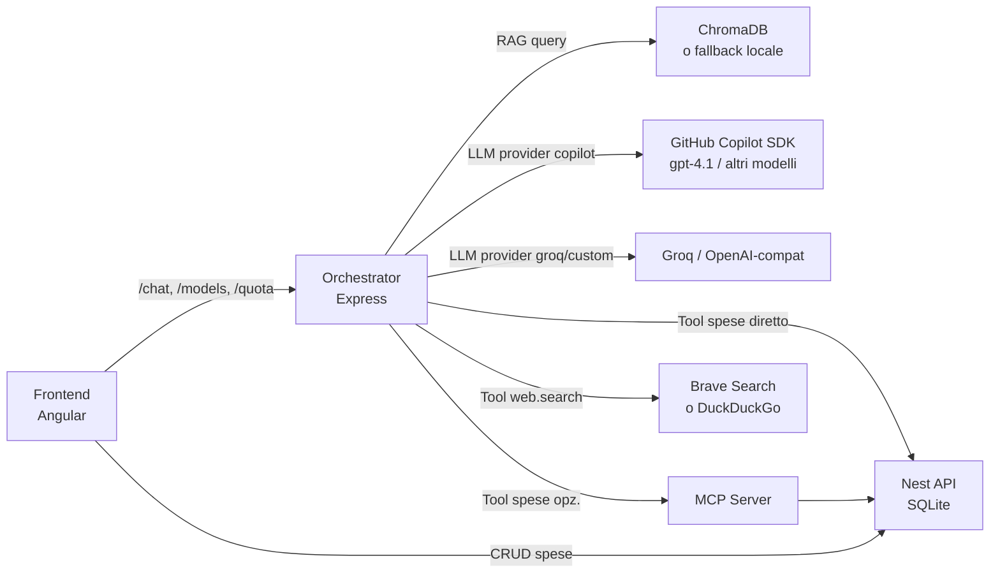

# Architettura del progetto (focus Chatbot RAG)

Questo documento descrive come sono fatte le 3 app e come collaborano tra loro, con focus sul chatbot e sul layer LLM basato su `@github/copilot-sdk`.

## Diagramma architettura



## Componenti principali

### 1. Frontend (Angular 21)
- UI CRUD spese + chat widget standalone.
- Porta: `http://localhost:4200`.
- Comunica con l'orchestrator per `/chat`, `/models`, `/quota` e con la Nest API per il CRUD.
- **Selezione modello**: recupera i modelli Copilot da `GET /models` e li mostra in un dropdown ordinato (gratuiti → premium → non-enabled). Il modello scelto viene passato in ogni richiesta `/chat`.
- **Monitoraggio quota**: mostra il contatore richieste premium della sessione e la quota residua da `GET /quota`.

### 2. API (NestJS + SQLite)
- CRUD spese su `api/data/expenses.sqlite`.
- Porta: `http://localhost:3000`.

### 3. Orchestrator (Node.js + Express)
- Pipeline RAG documentale + routing intent + tool loop + chiamate LLM.
- Porta: `http://localhost:3001`.
- Vector store: ChromaDB (`http://localhost:8000`) o fallback locale (`data/fallback-store.json`).

## Tecnologie usate

- **Angular 21**: frontend reattivo con componenti standalone e Angular Signals.
- **NestJS**: backend API con TypeORM e SQLite.
- **Express**: server leggero per chat, RAG e tool.
- **`@github/copilot-sdk`**: client LLM principale — wrappa la CLI di GitHub Copilot e gestisce sessioni e modelli.
- **ChromaDB**: vector store per RAG (fallback locale se non disponibile).
- **Embeddings**: `@chroma-core/default-embed` locale (default) o provider esterno.

## Provider LLM: `@github/copilot-sdk`

Il modulo `orchestrator/src/llm-copilot.ts` è un drop-in replacement di `chat()`:

| Responsabilità | Implementazione |
|---|---|
| Singleton `CopilotClient` | Processo CLI avviato una sola volta, `autoRestart: true` |
| Sessioni per chiamata | `client.createSession()` → `session.sendAndWait()` → `session.destroy()` |
| Cronologia messaggi | Iniettata nel `systemMessage`; solo l'ultimo messaggio è il prompt |
| Nessun tool nativo | `availableTools: []` — tool gestiti dall'orchestrator |
| Lista modelli | `client.rpc.models.list()` (bypass cache SDK interna) |
| Quota account | `client.rpc.account.getQuota()` |

`orchestrator/src/llm.ts` esegue il dispatch:

```typescript
if (env.LLM_PROVIDER === "copilot") return chatViaCopilotSdk(messages, model);
// altrimenti: OpenAI-compatible (Groq, custom)
```

## Flusso del chatbot (passo per passo)

### 1. Frontend invia il messaggio
`POST /chat` con la cronologia completa e il modello selezionato.

### 2. Guardrail di perimetro
Se la domanda è esplicitamente fuori perimetro (es. meteo, sport), risposta immediata di rifiuto senza chiamare l'LLM.

### 3. Router intent

L'orchestrator calcola in parallelo:
- **docScore**: rilevanza RAG sui PDF caricati.
- **expenseScore**: rilevanza sull'indice in-memory delle spese.

E sceglie l'intent:

| Intent | Azione |
|---|---|
| `expenses` | Abilita tool spese; ignora context doc |
| `documents` | Usa solo il context RAG documentale |
| `web` | Usa `web.search` per finanza/economia |
| `clarify` | Chiede chiarimento all'utente |
| out-of-scope | Rifiuto guidato |

### 4. Tool loop (max 4 passi)

L'orchestrator costruisce il system prompt, poi itera:

```
LLM risponde con JSON tool → orchestrator esegue tool → risultato come user message → LLM risposta finale
```

Tool disponibili: `expenses.list`, `expenses.create`, `expenses.update`, `expenses.delete`, `expenses.deleteAll`, `web.search`.

### 5. Risposta al frontend
`{ reply, sources, expensesChanged }` — il frontend mostra la risposta e ricarica le spese se `expensesChanged=true`.

## Flusso RAG: ingest

1. `POST /rag/ingest` con `docs[]` (id + testo + meta).
2. Chunking: split su `\n\n`, max 900 char per chunk.
3. Calcolo embeddings con il provider configurato.
4. Inserimento vettori in ChromaDB o file locale.

### Upload PDF
`POST /rag/upload` (multipart/form-data):
1. Parsing PDF con `pdf-parse`.
2. Conversione in Markdown → salvato in `orchestrator/data/markdown/`.
3. Ingest nel vector store con `sourceType: "pdf"`.

## Endpoint orchestrator

| Metodo | Path | Descrizione |
|---|---|---|
| `GET` | `/health` | Stato + tipo vector store |
| `GET` | `/models` | Lista modelli Copilot (solo con `LLM_PROVIDER=copilot`) |
| `GET` | `/quota` | Quota Copilot (solo con `LLM_PROVIDER=copilot`) |
| `POST` | `/chat` | Chat con RAG + tool loop |
| `POST` | `/rag/ingest` | Ingest testi nel vector store |
| `POST` | `/rag/search` | Ricerca semantica |
| `POST` | `/rag/upload` | Upload + ingest PDF |

## MCP (opzionale)

Il server MCP espone i tool spese via JSON-RPC (`tools/list`, `tools/call`).
L'orchestrator lo usa al posto delle chiamate dirette all'API se `TOOLS_BACKEND=mcp`.

## Configurazione LLM/Embeddings

In `orchestrator/.env`:

```env
# Provider consigliato
LLM_PROVIDER=copilot
COPILOT_MODEL=gpt-4.1
# COPILOT_CLI_PATH=...
# COPILOT_GITHUB_TOKEN=...

# Alternativa Groq
# LLM_PROVIDER=groq
# GROQ_API_KEY=...
# GROQ_MODEL=...

EMBEDDINGS_PROVIDER=default-embed
EMBEDDINGS_MODEL=Xenova/all-MiniLM-L6-v2
```

## Porte e dipendenze tra servizi

| Da | A | Canale |
|---|---|---|
| Frontend (4200) | Orchestrator (3001) | `/chat`, `/models`, `/quota`, `/rag/*` |
| Frontend (4200) | API Nest (3000) | CRUD spese |
| Orchestrator (3001) | ChromaDB (8000) | Vector store |
| Orchestrator (3001) | Copilot CLI / Groq | LLM |
| Orchestrator (3001) | Brave/DuckDuckGo | `web.search` tool |
| Orchestrator (3001) | MCP server (3400) | Tool spese (opzionale) |
| MCP server (3400) | API Nest (3000) | Tool spese |

## Riassunto (1 riga)

**Frontend** sceglie il modello e invia la chat → **Orchestrator** riconosce l'intent, fa RAG + tool loop tramite **Copilot SDK** (o Groq) → risponde con `reply` + `sources` → **Frontend** mostra il risultato e aggiorna le spese se necessario.
