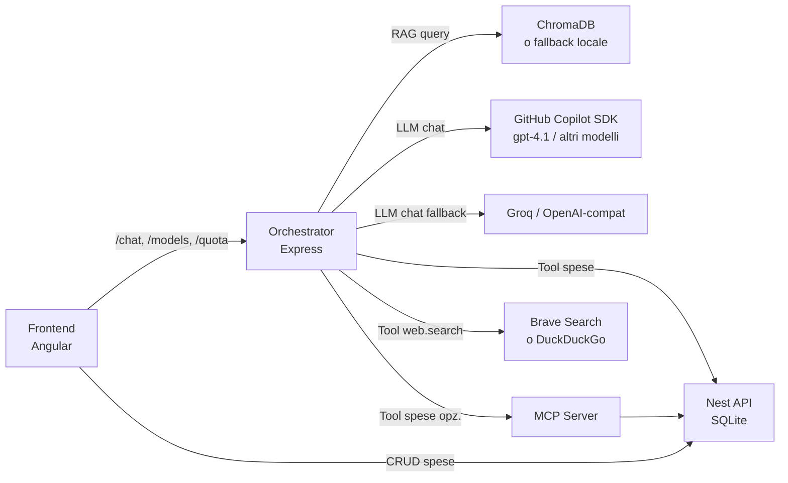

# Expense RAG (local, no Docker)

Questo progetto contiene 3 app separate (apri la cartella `expense-rag-local` in VS Code):

- `frontend/` — Angular 19: UI CRUD spese + chat widget con selezione modello e monitoraggio quota
- `api/` — NestJS: REST API spese + SQLite locale
- `orchestrator/` — Node.js (Express): pipeline RAG + routing intent + tool + LLM via `@github/copilot-sdk` (o provider OpenAI-compatible)

## Diagramma architettura



## Provider LLM supportati

| `LLM_PROVIDER` | Descrizione | Dipendenza |
|---|---|---|
| `copilot` | **Raccomandato** — usa `@github/copilot-sdk` e la CLI di GitHub Copilot. Supporta selezione modello dal frontend e monitoraggio quota. | GitHub Copilot CLI installata |
| `groq` | Chiamate a Groq via API OpenAI-compatible | `GROQ_API_KEY` + `GROQ_MODEL` |
| *(custom)* | Qualsiasi endpoint OpenAI-compatible | `LLM_BASE_URL` + `LLM_API_KEY` + `LLM_MODEL` |

### Come funziona il provider `copilot`

L'orchestrator usa `@github/copilot-sdk` (`CopilotClient`) come drop-in replacement per il client OpenAI:

1. **Singleton client** — il processo CLI viene avviato una sola volta alla prima richiesta e tenuto connesso (`autoRestart: true`).
2. **Sessioni dedicate** — ogni chiamata `chat()` crea una sessione, invia il prompt tramite `session.sendAndWait()` e poi distrugge la sessione.
3. **Gestione della cronologia** — la cronologia dei messaggi precedenti viene iniettata nel `systemMessage` della sessione; solo l'ultimo messaggio viene passato come prompt.
4. **Nessun tool nativo** — `availableTools: []` forza la modalità chat pura; i tool vengono gestiti interamente dall'orchestrator, non dalla CLI.
5. **API `/models`** — l'orchestrator espone la lista dei modelli Copilot disponibili (con `policy` e `billing`) richiamando `client.rpc.models.list()` direttamente (bypass della cache interna dell'SDK).
6. **API `/quota`** — espone lo snapshot della quota Copilot tramite `client.rpc.account.getQuota()`.

Il frontend Angular mostra nel chat widget:
- **Dropdown modello**: lista ordinata (gratuiti → premium → non-enabled), aggiornata all'avvio.
- **Contatore richieste premium** della sessione corrente (basato su `billing.multiplier`).
- **Quota residua** (entitlement Copilot, percentuale e data di reset).

## Guida all'installazione

Questa sezione copre tutto ciò che serve per mettere in piedi il progetto da zero, indipendentemente dal provider LLM scelto. Ci sono tre percorsi supportati: **GitHub Copilot SDK** (consigliato se hai una licenza Copilot), **Groq** (cloud, veloce, tier gratuito generoso) e **Ollama** (completamente locale, nessuna API key, massima privacy).

---

### Requisiti comuni (qualsiasi provider)

#### Node.js

Serve Node.js **20 LTS** o superiore. La versione 18.19+ funziona, ma 20 è quella testata.

Verifica la versione installata:
```bash
node --version   # deve stampare v20.x.x o superiore
npm --version    # deve stampare 10.x.x o superiore
```

Se non ce l'hai o la versione è troppo vecchia, installa tramite [nvm](https://github.com/nvm-sh/nvm) (macOS/Linux) o [nvm-windows](https://github.com/coreybutler/nvm-windows) (Windows). È fortemente preferibile gestire Node con nvm anziché installarlo a livello di sistema:

```bash
# macOS/Linux
nvm install 20
nvm use 20
nvm alias default 20

# Windows (nvm-windows)
nvm install 20
nvm use 20
```

#### Git

Necessario per clonare il repository. Verifica:
```bash
git --version
```

Se non è installato: https://git-scm.com/downloads

#### Clonare il repository

```bash
git clone <url-del-repo>
cd expense-rag-local
```

#### Installare le dipendenze npm

Va fatto una volta sola nella root del progetto, poi ogni volta che `package.json` cambia.

```bash
# dalla root del progetto
cd api && npm install
cd ../orchestrator && npm install
cd ../frontend && npm install
cd ..
```

> **Nota su Windows:** se `npm install` nell'orchestrator fallisce con errori su `@chroma-core/default-embed` o `better-sqlite3`, assicurati di avere installato le **Build Tools per C++** (Visual Studio Build Tools 2019+) oppure esegui `npm install --ignore-scripts` e poi usa `VECTOR_STORE=local` nel `.env`.

#### Creare il file `.env` dell'orchestrator

Il file `.env` non è mai committato nel repo (è in `.gitignore`). Devi crearlo a partire dal template:

```bash
# Windows (PowerShell)
Copy-Item orchestrator\.env.example orchestrator\.env

# macOS / Linux
cp orchestrator/.env.example orchestrator/.env
```

Apri `orchestrator/.env` con qualsiasi editor e configuralo in base al provider scelto (vedi sezioni sotto).

---

### Opzione A — GitHub Copilot SDK (consigliato)

**Quando usarla:** hai una licenza GitHub Copilot attiva (Individual, Business o Enterprise). Vantaggi: accesso ai modelli più recenti di OpenAI (gpt-4.1, gpt-5, o1), Claude e Gemini attraverso la tua licenza, selezione modello dinamica dal frontend, monitoraggio quota in-app. Nessuna API key da gestire: l'autenticazione usa il tuo account GitHub.

#### Prerequisiti

**1. Account GitHub con licenza Copilot attiva**

Verifica che la tua licenza sia attiva su https://github.com/settings/copilot. Se non ce l'hai, puoi attivare la trial gratuita (30 giorni) dalla stessa pagina.

**2. GitHub CLI (`gh`)**

La GitHub CLI è il mezzo con cui l'SDK autentica le richieste al servizio Copilot.

Windows (winget):
```powershell
winget install --id GitHub.cli
```

macOS (Homebrew):
```bash
brew install gh
```

Linux (Debian/Ubuntu):
```bash
type -p curl >/dev/null || (sudo apt update && sudo apt install curl -y)
curl -fsSL https://cli.github.com/packages/githubcli-archive-keyring.gpg | sudo dd of=/usr/share/keyrings/githubcli-archive-keyring.gpg
echo "deb [arch=$(dpkg --print-architecture) signed-by=/usr/share/keyrings/githubcli-archive-keyring.gpg] https://cli.github.com/packages stable main" | sudo tee /etc/apt/sources.list.d/github-cli.list > /dev/null
sudo apt update && sudo apt install gh -y
```

Verifica:
```bash
gh --version   # deve stampare gh version 2.x.x o superiore
```

**3. Autenticazione GitHub tramite CLI**

```bash
gh auth login
```

Il comando avvia un flusso interattivo. Seleziona:
- **GitHub.com** (non Enterprise Server, a meno che il tuo account sia su un'organizzazione Enterprise)
- **HTTPS** come protocollo preferito
- **Yes** per autenticare Git con le credenziali GitHub
- **Login with a web browser** (opzione più semplice)

Si apre il browser: copia il codice a 8 cifre mostrato nel terminale, incollalo nella pagina GitHub e autorizza.

Verifica che il login sia andato a buon fine:
```bash
gh auth status
# deve mostrare: Logged in to github.com as <tuo-username>
```

**4. Estensione GitHub Copilot per la CLI**

L'SDK Node.js (`@github/copilot-sdk`) si interfaccia con un processo `copilot` locale. Questo processo è fornito dall'estensione CLI ufficiale:

```bash
gh extension install github/gh-copilot
```

Verifica l'installazione:
```bash
gh copilot --version
```

Dopo l'installazione, l'eseguibile `copilot` diventa disponibile nel PATH in modo che l'SDK possa trovarlo automaticamente. Se per qualsiasi motivo non fosse nel PATH, puoi specificarne il percorso con `COPILOT_CLI_PATH` nel `.env`.

#### Configurazione `.env`

```env
LLM_PROVIDER=copilot

# Modello di default usato se il frontend non ne specifica uno esplicitamente.
# Puoi usare qualsiasi modello a cui la tua licenza Copilot dà accesso:
# gpt-4.1, gpt-4o, gpt-4.5, o4-mini, claude-sonnet-4.5, gemini-2.0-flash, ecc.
COPILOT_MODEL=gpt-4.1

# Opzionale: percorso assoluto alla CLI se "copilot" non è nel PATH di sistema.
# Windows esempio: COPILOT_CLI_PATH=C:\Users\TuoNome\AppData\Local\GitHub CLI\copilot.exe
# macOS/Linux esempio: COPILOT_CLI_PATH=/usr/local/bin/copilot
COPILOT_CLI_PATH=

# Opzionale: Personal Access Token GitHub con scope "copilot".
# Utile per ambienti CI/CD o server headless dove il login interattivo non è disponibile.
# Lascialo vuoto in sviluppo locale: l'SDK usa il token salvato da "gh auth login".
COPILOT_GITHUB_TOKEN=

# Timeout per le risposte LLM in millisecondi.
# I modelli premium (o1, o3) ragionano più a lungo: aumenta a 60000–120000 se usi quei modelli.
LLM_TIMEOUT_MS=30000
```

#### Verifica che funzioni

Avvia l'orchestrator e chiama l'endpoint `/models`:
```bash
cd orchestrator && npm run dev
# in un altro terminale:
curl http://localhost:3001/models
```

La risposta deve contenere un array `models` con almeno un elemento. Se l'array è vuoto controlla il log dell'orchestrator: vedresti un errore di connessione alla CLI.

---

### Opzione B — Groq (cloud, API key)

**Quando usarla:** vuoi una latenza molto bassa (Groq usa hardware dedicato), non hai una licenza Copilot, o vuoi un'opzione cloud senza dipendenze locali. Il tier gratuito offre ~14.400 richieste/giorno su modelli Llama 3 e Mixtral. È la configurazione più semplice in assoluto.

#### Prerequisiti

**1. Account Groq**

Registrati su https://console.groq.com. Non è necessaria una carta di credito per il tier gratuito.

**2. API Key**

Nel pannello Groq: **API Keys → Create API Key**. Copia subito la chiave: viene mostrata una sola volta.

La chiave ha il formato `gsk_...`.

#### Modelli consigliati

| Modello | Contesto | Note |
|---|---|---|
| `llama-3.3-70b-versatile` | 128k token | Ottimo bilanciamento qualità/velocità, tier gratuito |
| `llama-3.1-8b-instant` | 128k token | Ultra-veloce, tier gratuito, adatto per demo |
| `moonshotai/moonshot-v1-8k` | 8k token | Alternativa leggera |

#### Configurazione `.env`

```env
LLM_PROVIDER=groq
GROQ_API_KEY=gsk_xxxxxxxxxxxxxxxxxxxxxxxxxxxxxxxxxxxxxxxxxxxxxxxxxxxxxxxxxxxxxxxx
GROQ_MODEL=llama-3.3-70b-versatile

# Groq è generalmente molto veloce; 30 secondi è più che sufficiente.
LLM_TIMEOUT_MS=30000
```

> **Nota:** quando `LLM_PROVIDER=groq`, l'orchestrator imposta automaticamente `LLM_BASE_URL=https://api.groq.com/openai/v1`. Non devi impostarlo manualmente.

> **Nota su rate limiting:** il tier gratuito ha limiti per minuto (RPM) e per giorno (RPD) che variano per modello. Se ricevi errori `429 Too Many Requests`, attendi qualche secondo o passa a un modello con limiti più alti. I limiti aggiornati sono su https://console.groq.com/docs/rate-limits.

---

### Opzione C — Ollama (completamente locale, nessuna API key)

**Quando usarla:** vuoi il massimo della privacy (nulla lascia la tua macchina), non hai connettività o vuoi lavorare offline, o stai sperimentando con modelli open-source. Ollama espone un'API OpenAI-compatible su `localhost:11434`, quindi si integra senza modifiche al codice.

**Requisiti hardware minimi:**
- 8 GB RAM per modelli 7B (es. llama3.2:7b, mistral:7b)
- 16 GB RAM per modelli 13B
- GPU NVIDIA/AMD/Apple Silicon per prestazioni accettabili; CPU funziona ma è lenta

#### Prerequisiti

**1. Installare Ollama**

Windows:
```powershell
# Scarica e installa da:
# https://ollama.com/download/windows
# L'installer aggiunge "ollama" al PATH e installa il servizio di sistema.
```

macOS:
```bash
# Scarica l'app da https://ollama.com/download/mac
# Oppure via Homebrew:
brew install ollama
```

Linux:
```bash
curl -fsSL https://ollama.com/install.sh | sh
```

Verifica:
```bash
ollama --version
```

**2. Avviare il server Ollama**

Su Windows e macOS, l'installer avvia Ollama come servizio in background automaticamente all'accensione. Su Linux:

```bash
ollama serve &
```

Verifica che il server risponda:
```bash
curl http://localhost:11434/api/version
# {"version":"x.x.x"}
```

**3. Scaricare un modello LLM**

Scegli un modello in base alla RAM disponibile. La prima esecuzione scarica il file (diversi GB):

```bash
# 7B — buona qualità, ~4.7 GB, gira su 8 GB RAM
ollama pull llama3.2

# 8B — ottimo bilanciamento, ~4.9 GB
ollama pull llama3.1

# 7B — veloce e leggero, ~4.1 GB
ollama pull mistral

# Solo testo, 1B — ultra-leggero (~0.6 GB), adatto per macchine lente
ollama pull llama3.2:1b
```

Verifica che il modello sia disponibile:
```bash
ollama list
# NAME                 ID              SIZE    MODIFIED
# llama3.2:latest      a80c4f17acd5    2.0 GB  ...
```

**4. (Opzionale ma consigliato) Scaricare un modello di embedding Ollama**

Se vuoi anche gli embeddings completamente locali tramite Ollama (anziché `default-embed`):

```bash
ollama pull nomic-embed-text   # 274 MB, 768 dimensioni
# oppure
ollama pull mxbai-embed-large  # 670 MB, 1024 dimensioni — più preciso
```

#### Configurazione `.env`

Ollama non ha un provider dedicato nel codice: si usa come endpoint OpenAI-compatible.

```env
# Usa il provider "custom" lasciando LLM_PROVIDER a un valore non riservato
LLM_PROVIDER=ollama

# Ollama espone un'API OpenAI-compatible su questa URL
LLM_BASE_URL=http://localhost:11434/v1

# Ollama non richiede autenticazione; il campo non può essere vuoto per il client OpenAI,
# quindi si usa un placeholder qualsiasi.
LLM_API_KEY=ollama

# Il nome del modello deve corrispondere esattamente a quello mostrato da "ollama list"
LLM_MODEL=llama3.2

# Ollama su CPU può essere lento. Aumenta il timeout se le risposte vengono troncate.
# Con GPU dedicata 30s sono sufficienti; con CPU imposta 120000 o più.
LLM_TIMEOUT_MS=120000
```

Se vuoi usare anche Ollama per gli embeddings (alternativa a `default-embed`):

```env
EMBEDDINGS_PROVIDER=ollama-native
OLLAMA_URL=http://localhost:11434
EMBEDDINGS_MODEL=nomic-embed-text
```

> **Attenzione:** se cambi `EMBEDDINGS_PROVIDER` o `EMBEDDINGS_MODEL` dopo aver già indicizzato documenti, i vettori salvati diventano incompatibili (dimensioni diverse). Devi cancellare la collection Chroma o il file `orchestrator/data/fallback-store.json` e re-indicizzare tutto.

> **Performance tip:** se hai una GPU NVIDIA, assicurati che Ollama la stia usando. Controlla con `ollama ps` durante una generazione: la colonna `PROCESSOR` deve mostrare `100% GPU`. Se mostra `CPU`, installa i driver CUDA aggiornati.

---

### Configurazione embeddings (tutti i provider)

Gli embeddings sono indipendenti dal provider LLM. La scelta riguarda come vengono vettorizzati i testi per il RAG.

| `EMBEDDINGS_PROVIDER` | Descrizione | Quando usarlo |
|---|---|---|
| `default-embed` | **Default consigliato.** Usa `@chroma-core/default-embed` con il modello `Xenova/all-MiniLM-L6-v2` (384 dim). Gira in-process, nessuna dipendenza esterna, ~22 MB scaricati al primo avvio. | Sempre, a meno di esigenze specifiche |
| `ollama-native` | Chiama `POST /api/embeddings` su Ollama. Richiede un modello embedding scaricato (es. `nomic-embed-text`). | Quando vuoi tutto locale e hai già Ollama |
| `openai-compat` | Chiama `/v1/embeddings` sull'endpoint configurato (`LLM_BASE_URL`). | Quando usi un provider che offre embedding compatibili OpenAI |

Configurazione consigliata per **qualsiasi** provider LLM:

```env
EMBEDDINGS_PROVIDER=default-embed
EMBEDDINGS_MODEL=Xenova/all-MiniLM-L6-v2
```

Il modello viene scaricato automaticamente in cache locale la prima volta (`~/.cache/huggingface` o equivalente su Windows `%USERPROFILE%\.cache\huggingface`). Le volte successive parte immediatamente.

---

### Vector store (ChromaDB o fallback locale)

#### Opzione 1 — ChromaDB (consigliato per sviluppo)

Richiede Python 3.11. Installa il client ChromaDB e avvia il server locale:

Windows (PowerShell):
```powershell
py -3.11 -m pip install -U chromadb

# Avvialo dalla root del progetto (o da dove preferisci salvare i dati)
chroma run --host localhost --port 8000 --path .\data\chroma
```

Se `chroma` non è nel PATH dopo l'installazione (succede su alcuni sistemi Windows):
```powershell
& "$env:LOCALAPPDATA\Programs\Python\Python311\Scripts\chroma.exe" `
    run --host localhost --port 8000 --path .\data\chroma
```

macOS / Linux:
```bash
python3 -m pip install -U chromadb
chroma run --host localhost --port 8000 --path ./data/chroma
```

In `orchestrator/.env`:
```env
VECTOR_STORE=chroma
CHROMA_URL=http://localhost:8000
```

#### Opzione 2 — Fallback locale (zero dipendenze)

Non richiede Python né server esterni. I vettori vengono salvati in un file JSON.

In `orchestrator/.env`:
```env
VECTOR_STORE=local
```

> **Limitazione:** il fallback locale carica tutti i vettori in RAM e fa ricerca lineare. Va bene fino a qualche migliaio di chunk (~100–200 documenti). Per corpora più grandi usa ChromaDB.

---

### Cambiare provider LLM in corsa

L'unico file da toccare è `orchestrator/.env`. Il file è strutturato con **tre blocchi commentati** (uno per provider): basta commentare il blocco attivo, decommentare quello nuovo, riavviare solo l'orchestrator. API e frontend non vanno toccati.

```
# Nel file orchestrator/.env:
#
# 1. Commenta il blocco corrente (aggiungi # davanti a ogni riga del blocco attivo)
# 2. Decommenta il blocco del nuovo provider (rimuovi # davanti alle sue righe)
# 3. Compila i campi richiesti (API key, modello, ecc.)
# 4. Nella sezione "PROVIDER ATTIVO" sostituisci le variabili con quelle del nuovo blocco
# 5. Salva e riavvia: Ctrl+C sul terminale orchestrator, poi npm run dev
```

Esempio: passare da Groq a Copilot:
```env
# Prima (Groq attivo):
LLM_PROVIDER=groq
GROQ_API_KEY=gsk_...
GROQ_MODEL=llama-3.3-70b-versatile

# Dopo (Copilot attivo):
LLM_PROVIDER=copilot
COPILOT_MODEL=gpt-4.1
```

> **Nota frontend:** il dropdown modelli e il monitor quota nel chat widget appaiono solo con `LLM_PROVIDER=copilot`. Con Groq e Ollama il widget funziona normalmente ma senza selezione modello.

#### Riepilogo: cosa cambia e cosa no quando si cambia provider

| Cosa | Cambia? | Note |
|---|---|---|
| File `orchestrator/.env` | ✅ Sì | Unico file da modificare |
| Riavvio orchestrator | ✅ Sì | Legge le env solo all'avvio |
| Riavvio API (`api/`) | ❌ No | Non dipende dal provider LLM |
| Riavvio frontend | ❌ No | Si adatta automaticamente (il dropdown scompare/riappare) |
| Dati ChromaDB / vettori | ❌ No | I vettori dipendono dall'*embedding*, non dall'LLM |
| Dati SQLite | ❌ No | Completamente indipendenti |

> **Unico caso in cui toccare i vettori:** se cambi `EMBEDDINGS_PROVIDER` o `EMBEDDINGS_MODEL` (non il provider LLM), i vettori già indicizzati diventano incompatibili. In quel caso cancella la collection Chroma (`data/chroma/`) o il file `orchestrator/data/fallback-store.json` e re-indicizza i documenti.

---

## Avvio dei servizi

```bash
# Terminal 1 — API NestJS
cd api && npm run start:dev          # http://localhost:3000

# Terminal 2 — Orchestrator
cd orchestrator && npm run dev       # http://localhost:3001

# Terminal 3 — Frontend Angular
cd frontend && npm start             # http://localhost:4200

# (Opzionale) Terminal 4 — ChromaDB
chroma run --host localhost --port 8000 --path ./data/chroma
```

In alternativa, usa lo script tutto-in-uno:
```powershell
.\scripts\start-all.ps1
# Con MCP server:
.\scripts\start-all.ps1 -StartMcp
```

## Test rapido

- Apri http://localhost:4200 e aggiungi una spesa tramite UI.
- Chat: `"Elenca le mie spese"` → attiva il tool `expenses.list`.
- Chat (con Copilot): seleziona un modello dal dropdown nel widget chat.
- Ingest testo nella KB:
  ```bash
  curl -X POST http://localhost:3001/rag/ingest \
    -H "Content-Type: application/json" \
    -d "{\"docs\":[{\"id\":\"howto\",\"text\":\"Questa app gestisce spese personali...\"}]}"
  ```
- Upload PDF:
  ```bash
  curl -X POST http://localhost:3001/rag/upload -F "file=@documento.pdf"
  ```
- Ricerca semantica:
  ```bash
  curl -X POST http://localhost:3001/rag/search \
    -H "Content-Type: application/json" \
    -d "{\"query\":\"spese personali\",\"k\":3}"
  ```
  Filtro solo PDF:
  ```bash
  curl -X POST http://localhost:3001/rag/search \
    -H "Content-Type: application/json" \
    -d "{\"query\":\"policy rimborsi\",\"k\":3,\"filter\":{\"sourceType\":\"pdf\"}}"
  ```
- Modelli Copilot disponibili: `GET http://localhost:3001/models`
- Quota Copilot: `GET http://localhost:3001/quota`

## Demo app e guardrail di perimetro

1. Ingest della KB demo:
```powershell
.\scripts\ingest-demo-kb.ps1
```
2. Prova in chat:
   - `"Elenca le mie spese"` → usa tool spese
   - `"Aggiungi una spesa: 12.50 EUR il 2026-01-27 categoria food descrizione pizza"`
   - `"Inflazione Italia 2025?"` → attiva `web.search`
   - `"Che tempo fa oggi?"` → risposta di rifiuto (fuori perimetro)

Variabili di configurazione guardrail in `orchestrator/.env`:
```env
SCOPE_DOMAIN=app demo
SCOPE_MIN_SCORE=0.2
```

## Router intent

Ad ogni messaggio l'orchestrator classifica l'intent tra:

| Intent | Descrizione |
|---|---|
| `expenses` | Domanda sulle spese → usa tool `expenses.*` |
| `documents` | Domanda su PDF caricati → usa solo context RAG documentale |
| `web` | Domanda su finanza/economia → usa tool `web.search` |
| `clarify` | Ambiguo → chiede chiarimento |
| out-of-scope | Fuori perimetro → rifiuto guidato |

Parametri in `orchestrator/.env`:
```env
DOC_MIN_SCORE=0.2
EXPENSES_MIN_SCORE=0.2
DOC_K=4
EXPENSES_K=4
INTENT_DELTA=0.05
EXPENSES_CACHE_TTL_MS=30000
```

## Tool disponibili

| Tool | Descrizione |
|---|---|
| `expenses.list` | Elenca tutte le spese |
| `expenses.create` | Crea una nuova spesa |
| `expenses.update` | Aggiorna una spesa esistente |
| `expenses.delete` | Elimina una spesa per ID |
| `expenses.deleteAll` | Elimina tutte le spese |
| `web.search` | Ricerca web (Brave Search API se `WEBSEARCH_API_KEY` è impostata, altrimenti DuckDuckGo) |

Per abilitare Brave Search:
```env
WEBSEARCH_API_KEY=BSA...
```

## Upload PDF (RAG)

Il backend converte i PDF in `.md` e li indicizza nel vector store.
I `.md` vengono salvati in `orchestrator/data/markdown/`.

```bash
curl -X POST http://localhost:3001/rag/upload -F "file=@documento.pdf"
# Risposta: { "ok": true, "chunks": 12, "mdFile": "...", "docId": "..." }
```

## MCP Server (opzionale)

Sostituisce le chiamate dirette all'API con un server MCP locale (JSON-RPC):

```bash
cd orchestrator && npm run mcp:dev   # http://localhost:3400/rpc
```

In `orchestrator/.env`:
```env
TOOLS_BACKEND=mcp
MCP_URL=http://localhost:3400/rpc
```

## Variabili d'ambiente (riferimento completo)

| Variabile | Default | Descrizione |
|---|---|---|
| `LLM_PROVIDER` | `groq` | Provider LLM: `copilot`, `groq`, o custom |
| `COPILOT_MODEL` | `gpt-4.1` | Modello default per il provider `copilot` |
| `COPILOT_CLI_PATH` | *(PATH)* | Percorso custom alla CLI Copilot |
| `COPILOT_GITHUB_TOKEN` | — | Token GitHub per autenticazione Copilot CLI |
| `GROQ_API_KEY` | — | Chiave API Groq |
| `GROQ_MODEL` | — | Modello Groq (es. `llama-3.3-70b-versatile`) |
| `LLM_BASE_URL` | — | Base URL provider custom |
| `LLM_API_KEY` | — | Chiave API provider custom |
| `LLM_MODEL` | — | Modello provider custom |
| `LLM_TIMEOUT_MS` | `30000` | Timeout LLM in ms |
| `VECTOR_STORE` | `chroma` | `chroma` o `local` |
| `CHROMA_URL` | `http://localhost:8000` | URL ChromaDB |
| `EMBEDDINGS_PROVIDER` | `default-embed` | `default-embed`, `openai-compat`, `ollama-native` |
| `EMBEDDINGS_MODEL` | `Xenova/all-MiniLM-L6-v2` | Modello embeddings |
| `WEBSEARCH_API_KEY` | — | API key Brave Search (opzionale) |
| `TOOLS_BACKEND` | `api` | `api` o `mcp` |
| `MCP_URL` | `http://localhost:3400/rpc` | URL server MCP |
| `SCOPE_DOMAIN` | `app demo` | Dominio perimetro guardrail |
| `SCOPE_MIN_SCORE` | `0.2` | Score minimo guardrail |
| `DOC_MIN_SCORE` | `0.2` | Score minimo RAG documenti |
| `EXPENSES_MIN_SCORE` | `0.2` | Score minimo indice spese |
| `DOC_K` | `4` | Chunk documenti per query RAG |
| `EXPENSES_K` | `4` | Risultati indice spese per query |
| `INTENT_DELTA` | `0.05` | Delta minimo fra score documenti e spese |
| `EXPENSES_CACHE_TTL_MS` | `30000` | TTL cache indice spese in ms |

## Note
- Database spese: `api/data/expenses.sqlite`
- Vector store fallback locale: `orchestrator/data/fallback-store.json`
- Markdown PDF caricati: `orchestrator/data/markdown/`
- Architettura dettagliata: vedi [ARCHITETTURA.md](ARCHITETTURA.md)
