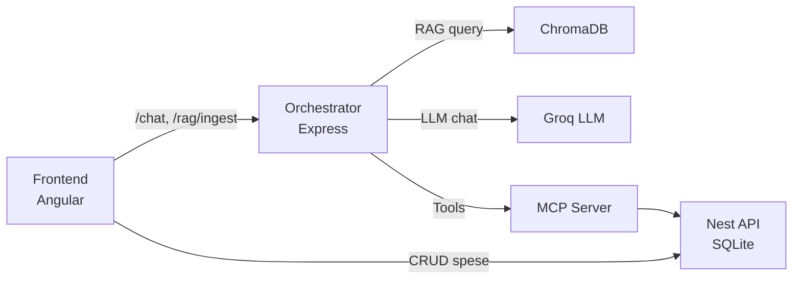

# Expense RAG (local, no Docker)

Questo progetto contiene 3 app separate (apri la cartella `expense-rag-local` in VS Code):

- `frontend/` - Angular v19 (UI CRUD + chat)
- `api/` - NestJS (CRUD spese) + SQLite locale
- `orchestrator/` - Node.js (Express) che orchestrationa: RAG documenti (Chroma o fallback locale) + routing spese vs documenti + chiamate LLM + tool verso API (o MCP)

## Diagramma architettura


## Requisiti
- Node.js 20+ consigliato (anche 18.19+ di solito va bene)
- (Opzionale ma consigliato) Python 3.11 per far girare Chroma senza Docker

## Setup iniziale (una volta sola)
1) Installa le dipendenze di ogni app:
```bash
cd api
npm install
cd ../orchestrator
npm install
cd ../frontend
npm install
```

2) Configura l'orchestrator:
```bash
cd orchestrator
copy .env.example .env   # Windows
# cp .env.example .env   # macOS/Linux
```
Apri `orchestrator/.env` e imposta almeno:
```
LLM_PROVIDER=groq
GROQ_API_KEY=...
GROQ_MODEL=openai/gpt-oss-120b
```
Embeddings (default consigliato, locale):
```
EMBEDDINGS_PROVIDER=default-embed
EMBEDDINGS_MODEL=Xenova/all-MiniLM-L6-v2
```

## Avvio Chroma (senza Docker, consigliato)
Chroma in JS si usa come client verso un server locale. Il modo piu semplice senza Docker e il CLI Python (installa prima `chromadb`):

Windows (PowerShell):
```powershell
py -3.11 -m pip install -U chromadb
chroma run --host localhost --port 8000 --path .\data\chroma
```
Se `chroma` non e riconosciuto, usa il percorso completo:
```powershell
& "C:\Users\%USERNAME%\AppData\Local\Programs\Python\Python311\Scripts\chroma.exe" run --host localhost --port 8000 --path .\data\chroma
```

macOS/Linux:
```bash
python3 -m pip install -U chromadb
chroma run --host localhost --port 8000 --path ./data/chroma
```

Se non puoi usare Python o non vuoi avviare Chroma, puoi usare il fallback locale:
nel file `orchestrator/.env` imposta `VECTOR_STORE=local`.

## Avvio backend Nest (API)
```bash
cd api
npm run start:dev
```
API: http://localhost:3000

## Avvio orchestrator (chat + RAG)
```bash
cd orchestrator
npm run dev
```
Orchestrator: http://localhost:3001

## Avvio frontend Angular
```bash
cd frontend
npm start
```
Frontend: http://localhost:4200

## Test rapido
- UI: aggiungi una spesa
- Chat: "Elenca le mie spese" (attiva tool `expenses.list`)
- RAG: puoi ingestare testo di KB:
  ```bash
  curl -X POST http://localhost:3001/rag/ingest -H "Content-Type: application/json" -d "{"docs":[{"id":"howto","text":"Questa app gestisce spese personali..."}]}"
  ```
- PDF: carica un documento e chiedi qualcosa sul contenuto
- Ricerca semantica (API):
  ```bash
  curl -X POST http://localhost:3001/rag/search -H "Content-Type: application/json" -d "{"query":"spese personali","k":3}"
  ```
  Filtro solo PDF:
  ```bash
  curl -X POST http://localhost:3001/rag/search -H "Content-Type: application/json" -d "{"query":"policy rimborsi","k":3,"filter":{"sourceType":"pdf"}}"
  ```

## Demo app (scope guardrail)
1) Ingest demo KB:
```powershell
.\scripts\ingest-demo-kb.ps1
```
2) Prova in chat:
- "Elenca le mie spese"
- "Aggiungi una spesa: 12.50 EUR il 2026-01-27 categoria food descrizione pizza"
- Fuori perimetro: "Che tempo fa oggi?" -> risposta di rifiuto

Opzionale: puoi regolare `SCOPE_DOMAIN` e `SCOPE_MIN_SCORE` in `orchestrator/.env`.

## Router intent (Spese vs Documenti)
Il chatbot decide se una domanda riguarda:
- Spese nel database (usa i tool)
- Documenti PDF caricati (usa il RAG documentale)

Parametri principali in `orchestrator/.env`:
```
DOC_MIN_SCORE=0.2
EXPENSES_MIN_SCORE=0.2
DOC_K=4
EXPENSES_K=4
INTENT_DELTA=0.05
EXPENSES_CACHE_TTL_MS=30000
```

## Upload PDF (RAG)
Il backend accetta PDF e li converte in `.md` per l'indicizzazione semantica.
I `.md` generati vengono salvati in `orchestrator/data/markdown`.
Carica un file con `multipart/form-data`:
```bash
curl -X POST http://localhost:3001/rag/upload -F "file=@documento.pdf"
```

## MCP Server (opzionale)
Per sostituire le query dirette all'API con un server MCP locale:
1) Avvia il server MCP:
```bash
cd orchestrator
npm run mcp:dev
```
2) Imposta in `orchestrator/.env`:
```
TOOLS_BACKEND=mcp
MCP_URL=http://localhost:3400/rpc
```
Se usi lo script di avvio:
```powershell
.\scripts\start-all.ps1 -StartMcp
```

## Note
- Database spese: `api/data/expenses.sqlite`
- Vector store fallback locale: `orchestrator/data/local-vectors.json`
- Architettura: vedi `ARCHITETTURA.md`
